# spring-back
# Dbeaver and postman
## Alunos
Imagem mostrando o resultado que é obtido do banco aluno_online_p3b:  

 
Imagem mostrando o request feito pelo postman, a variável 'urlBase' é basicamente o valor: http://localhost:8080 

 
Listando aluno por meio de seu id: 

 
Listar todos os alunos: 

 
Banco Após exclusão de usuário por id: 

## Professores
Após a criação do endpoint de professores, segue imagens de sua implementação: 
Criação de professor: 
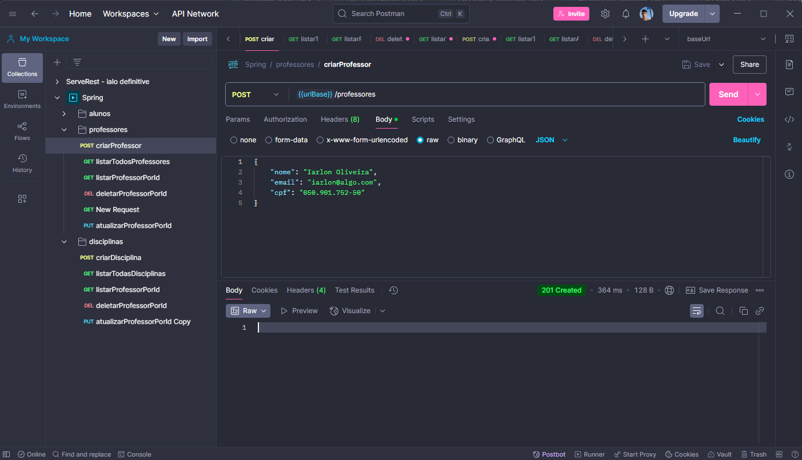
 
Atualização de professor: 
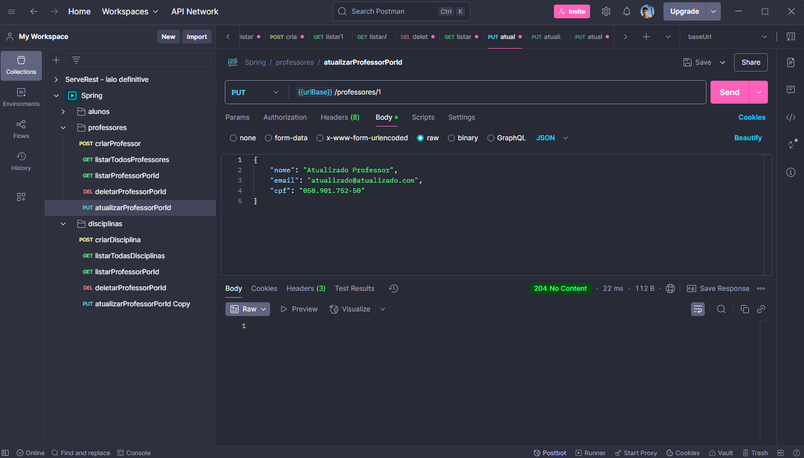
 
Listagem de professor: 
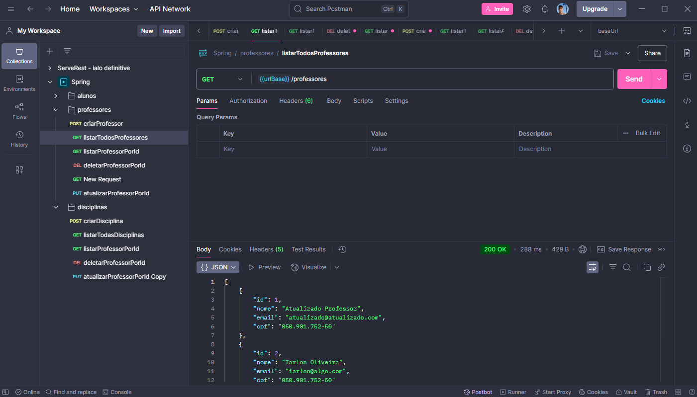
Exclusão de professor: 
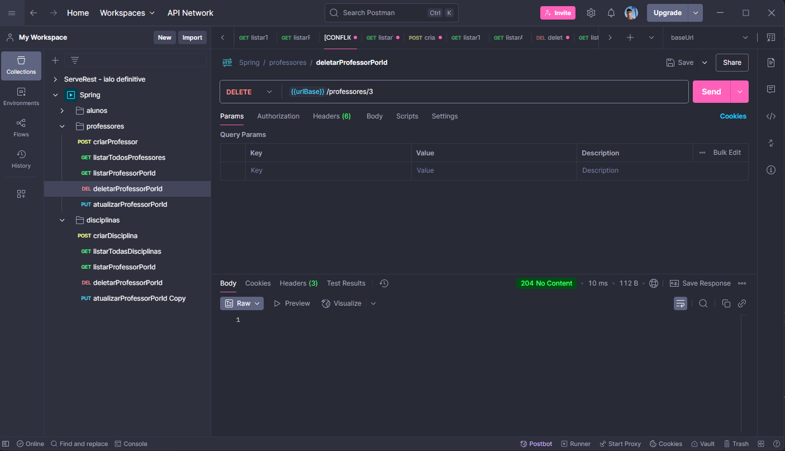

## Outros
Após a criação de professor em disciplinas, não será possível excluir o professor antes de excluir disciplina.  Visualize que ao tentar excluir professor, coloquei um professor que existe no banco, porém ele está associado a uma disciplina. 
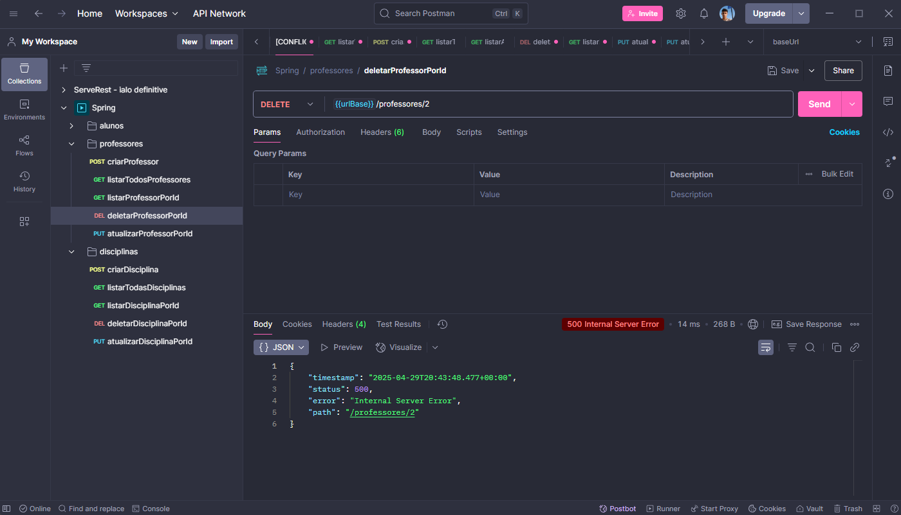 
Script utilizado para criar pessoas de forma fácil por meio do Postman: 
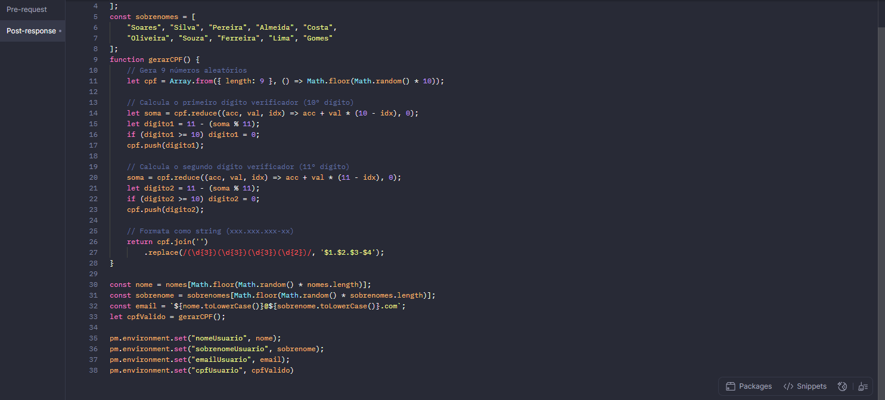 
Swagger do projeto: 
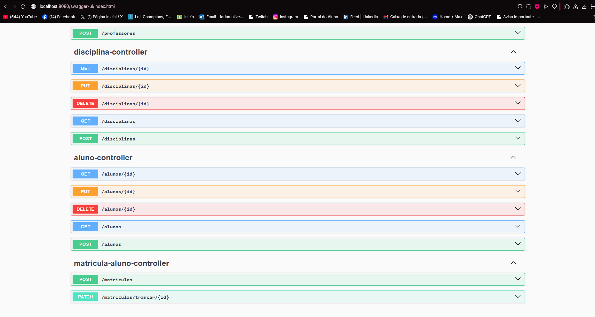 

## Disciplina
Após a criação do endpoint de disciplina, segue imagens de sua implementação: 
Criação de disciplina:  
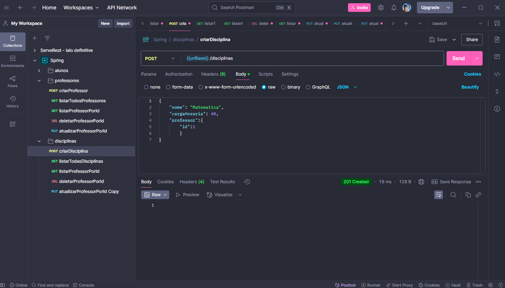
 
Atualização de disciplina: 
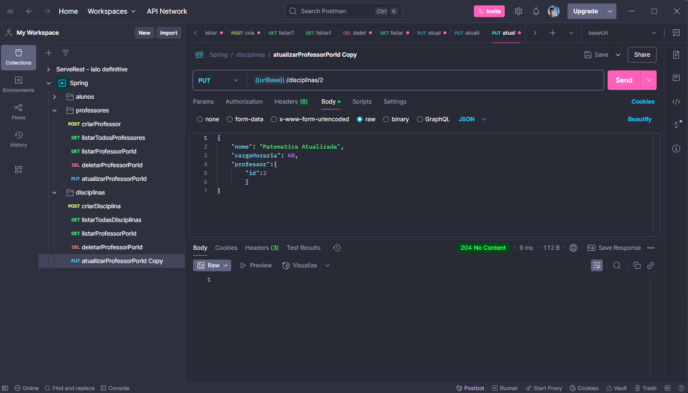
 
Listagem de disciplina: 
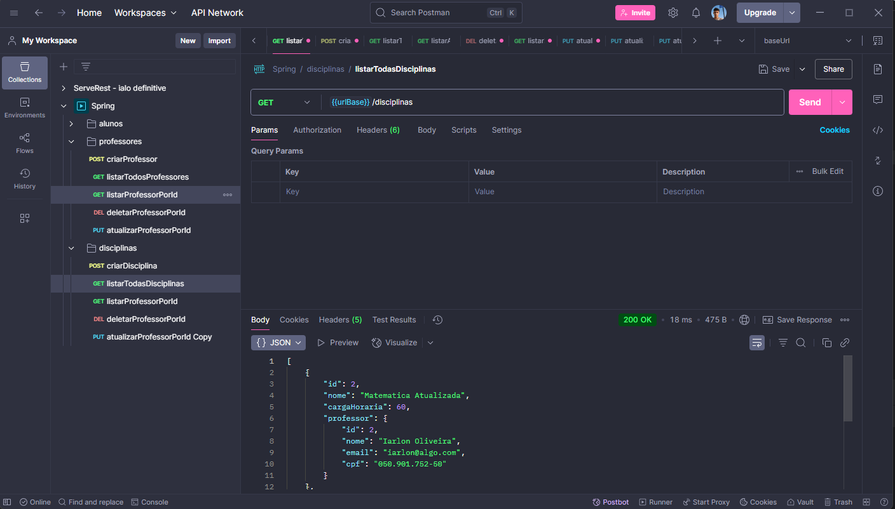
 
Exclusão de disciplina: 
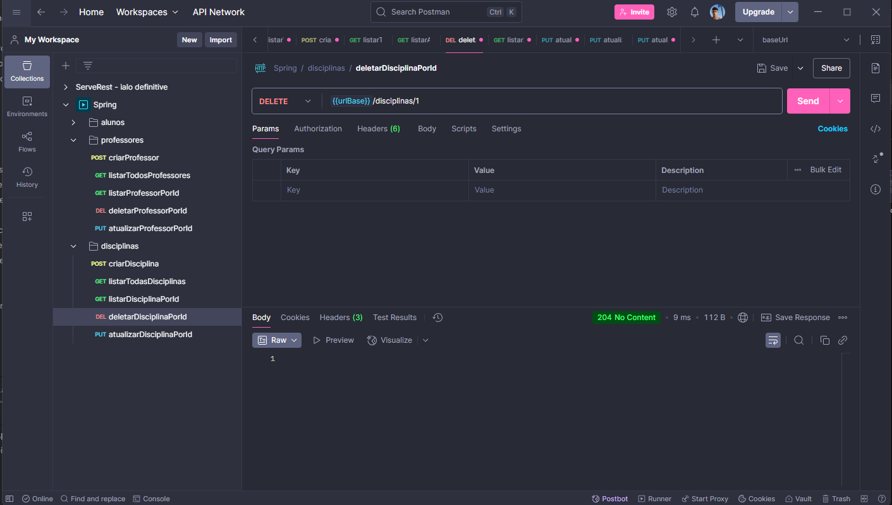

## Matricula
Após a criação do endpoint de matricula, segue imagens de sua implementação: 
Criação de matricula:  
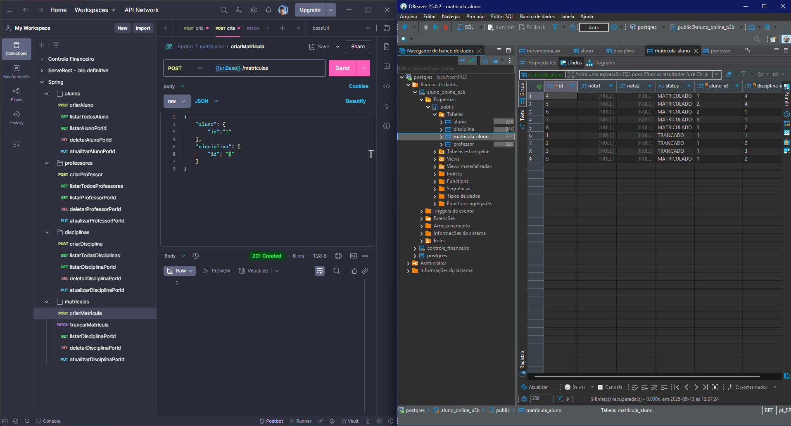
 
Trancar matricula:  
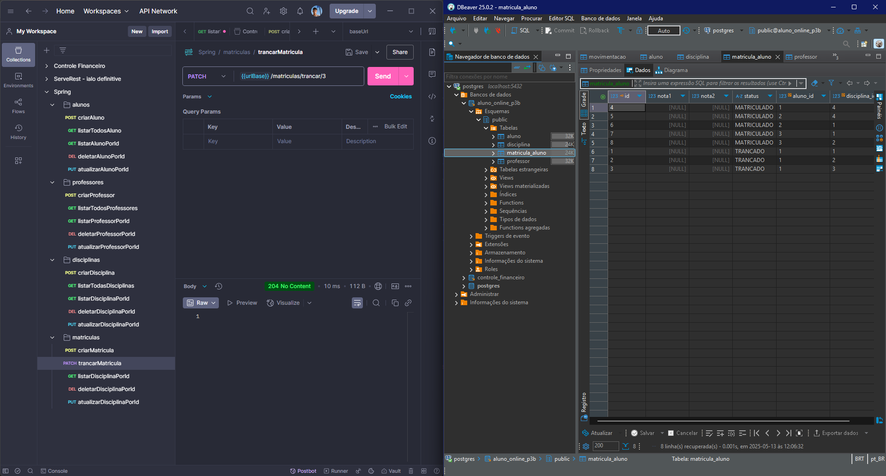
 