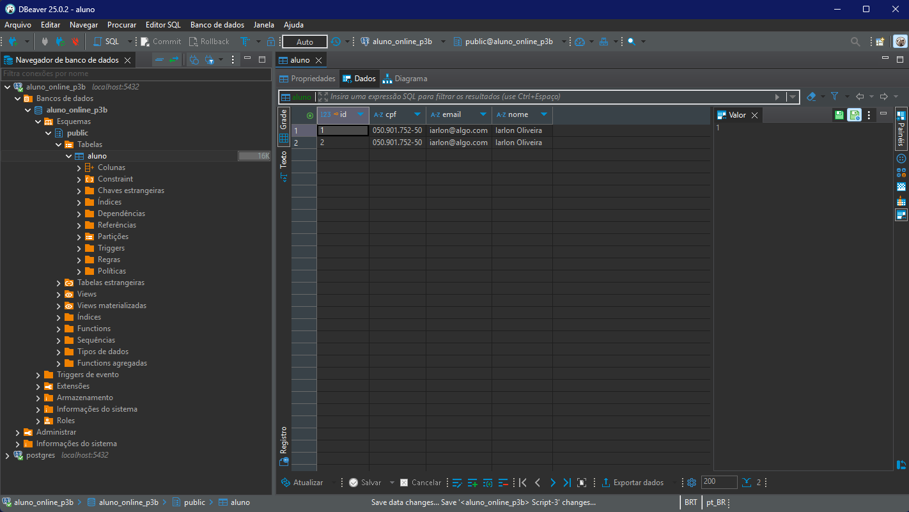
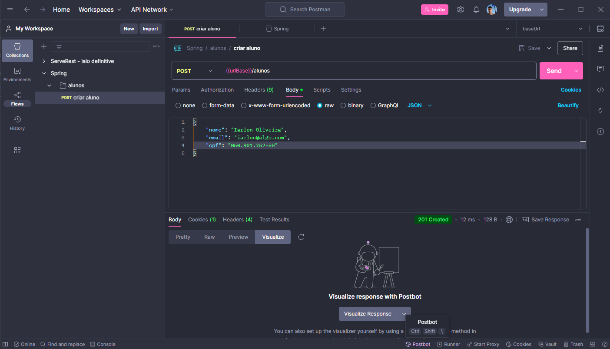
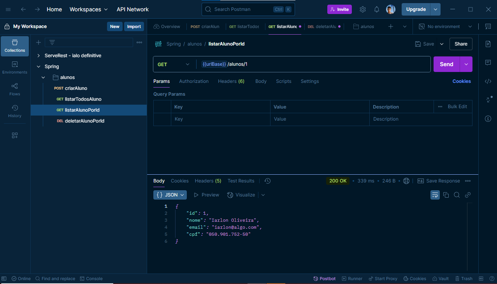
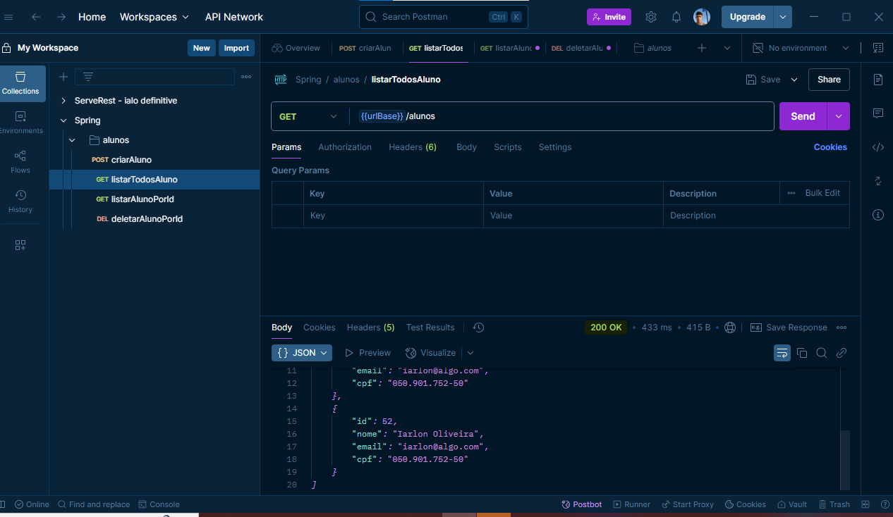
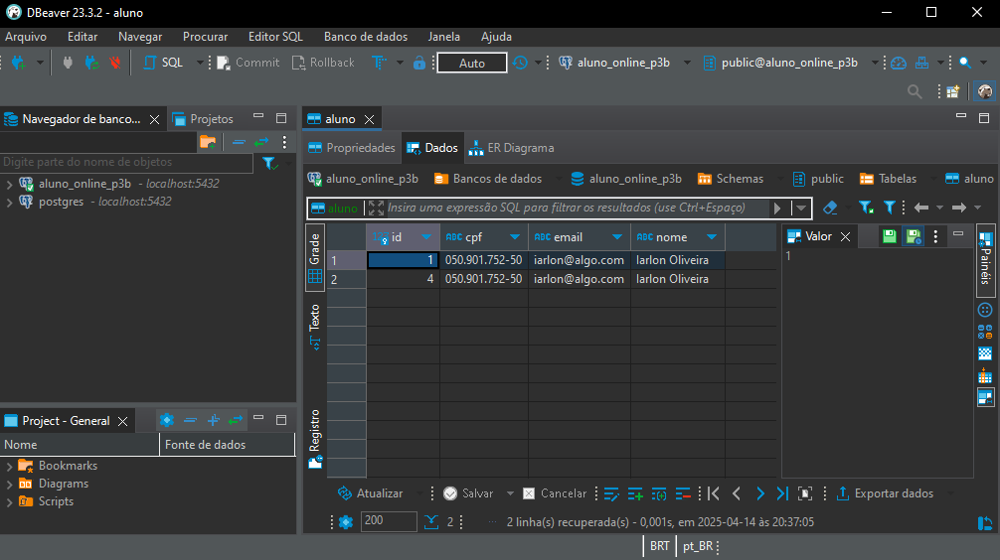

# spring-back
## Dbeaver and postman
Imagem mostrando o resultado que é obtido do banco aluno_online_p3b:  

 
Imagem mostrando o request feito pelo postman, a variável 'urlBase' é basicamente o valor: http://localhost:8080 

 
Listando aluno por meio de seu id: 

 
Listar todos os alunos: 

 
Banco Após exclusão de usuário por id: 
