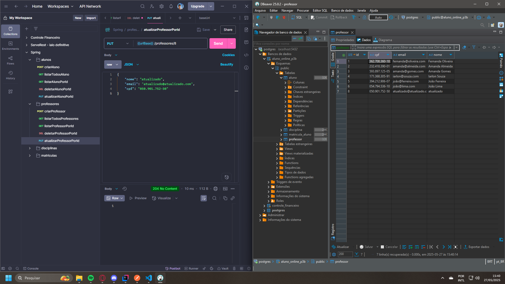
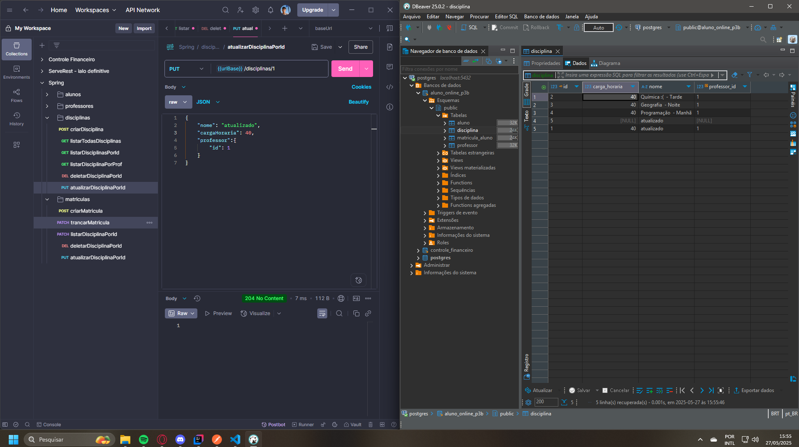

# Aluno Online - Backend

Sistema de gerenciamento acadêmico para alunos, professores, disciplinas e matrículas, desenvolvido em Java com Spring Boot.

## Sumário

- [Sobre o Projeto](#sobre-o-projeto)
- [Tecnologias Utilizadas](#tecnologias-utilizadas)
- [Como Executar](#como-executar)
- [Banco de Dados](#banco-de-dados)
- [Documentação da API (Swagger)](#documentação-da-api-swagger)
- [Exemplos de Uso](#exemplos-de-uso)
  - [Alunos](#alunos)
  - [Professores](#professores)
  - [Disciplinas](#disciplinas)
  - [Matrícula](#matrícula)
- [Scripts Úteis](#scripts-úteis)
- [Observações](#observações)

---

## Sobre o Projeto

Este projeto é uma API RESTful para gerenciamento de alunos, professores, disciplinas e matrículas. Permite criar, listar, atualizar e deletar registros, além de emitir históricos escolares, controlar o status das matrículas e garantir regras de negócio como impedir alterações não autorizadas.

## Tecnologias Utilizadas

- Java 17
- Spring Boot 3.4.5
- Spring Data JPA
- PostgreSQL
- Lombok
- Swagger/OpenAPI
- Maven

## Como Executar

1. **Clone o repositório:**
   ```sh
   git clone <url-do-repo>
   cd spring-back
   ```

2. **Configure o banco de dados:**
   - Certifique-se de ter um banco PostgreSQL rodando.
   - Altere as configurações em [`src/main/resources/application.properties`](src/main/resources/application.properties) se necessário.

3. **Instale as dependências e rode o projeto:**
   ```sh
   ./mvnw spring-boot:run
   ```
   Ou, no Windows:
   ```sh
   mvnw.cmd spring-boot:run
   ```

4. **Acesse a documentação Swagger:**
   - [http://localhost:8080/swagger-ui/index.html](http://localhost:8080/swagger-ui/index.html)

## Banco de Dados

- O projeto utiliza PostgreSQL.
- Exemplo de configuração:
  ```
  spring.datasource.url=jdbc:postgresql://localhost:5432/aluno_online_p3b
  spring.datasource.username=postgres
  spring.datasource.password=123
  ```

## Documentação da API (Swagger)

A documentação interativa está disponível em:  
[http://localhost:8080/swagger-ui/index.html](http://localhost:8080/swagger-ui/index.html)

---

## Exemplos de Uso

### Alunos

- **Criar aluno:**  
  

- **Atualizar aluno:**  
  

- **Deletar aluno:**  
  

- **Listar aluno por ID:**  
  

- **Listar todos os alunos:**  
  

### Professores

- **Criar professor:**  
  

- **Atualizar professor:**  
  

- **Listar professores:**  
  

- **Deletar professor:**  
  

### Disciplinas

- **Criar disciplina:**  
  

- **Evita aluno impor nota em matrícula sem permissão:**  
  
  > Esta funcionalidade impede que um aluno atualize as notas de uma matrícula caso não esteja autorizado, garantindo a integridade das avaliações.

- **Atualizar disciplina:**  
  

- **Deletar disciplina:**  
  

- **Listar disciplina por ID:**  
  

- **Listar todas as disciplinas:**  
  

- **Listar disciplinas por professor:**  
  

### Matrícula

- **Criar matrícula:**  
  
  
- **Erro ao matricular aluno já MATRICULADO ou APROVADO:**  
  
  > Impede criar matricula de aluno com status MATRICULADO ou APROVADO.

- **Trancar matrícula:**  
  

- **Atualizar notas da matrícula:**  
  

- **Erro ao atualizar nota sem status MATRICULADO:**  
  
  > Impede atualizar notas se a matrícula não estiver com status MATRICULADO.

- **Emitir histórico escolar:**  
  

---


## Endpoints Principais

### Alunos

- `POST /alunos` - Criar aluno
- `GET /alunos` - Listar todos os alunos
- `GET /alunos/{id}` - Buscar aluno por ID
- `PUT /alunos/{id}` - Atualizar aluno
- `DELETE /alunos/{id}` - Deletar aluno

### Professores

- `POST /professores` - Criar professor
- `GET /professores` - Listar todos os professores
- `GET /professores/{id}` - Buscar professor por ID
- `PUT /professores/{id}` - Atualizar professor
- `DELETE /professores/{id}` - Deletar professor

### Disciplinas

- `POST /disciplinas` - Criar disciplina
- `GET /disciplinas` - Listar todas as disciplinas
- `GET /disciplinas/{id}` - Buscar disciplina por ID
- `PUT /disciplinas/{id}` - Atualizar disciplina
- `DELETE /disciplinas/{id}` - Deletar disciplina
- `GET /disciplinas/professor/{professorId}` - Listar disciplinas por professor

### Matrícula

- `POST /matriculas` - Criar matrícula
- `PATCH /matriculas/trancar/{id}` - Trancar matrícula
- `PATCH /matriculas/atualizar-notas/{id}` - Atualizar notas da matrícula
- `GET /matriculas/historico/{alunoId}` - Emitir histórico escolar do aluno

---

## Scripts Úteis

- **Script para criar pessoas via Postman:**  
  

---

## Observações

- Antes de excluir um professor, é necessário remover as disciplinas associadas a ele.
- O projeto segue boas práticas REST e utiliza DTOs para requisições e respostas.
- Algumas operações possuem regras de negócio para garantir integridade, como impedir atualização de notas por usuários não autorizados ou impedir matrícula duplicada.

---

Desenvolvido para fins acadêmicos.